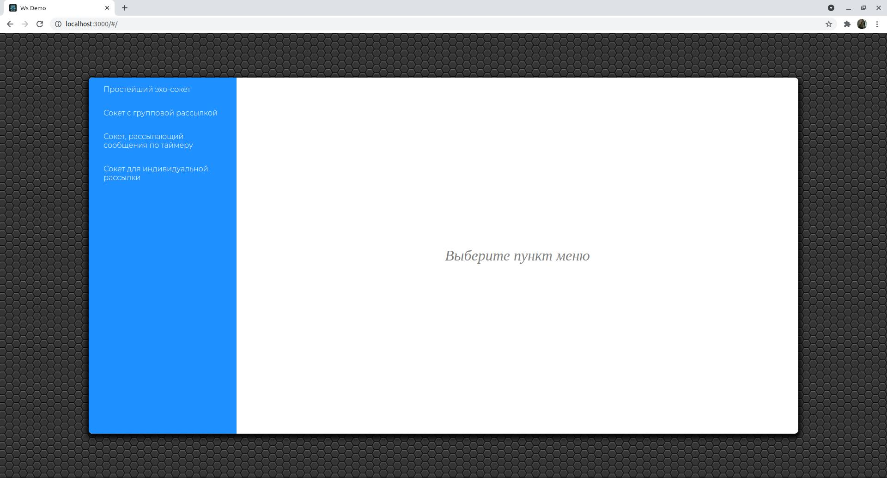
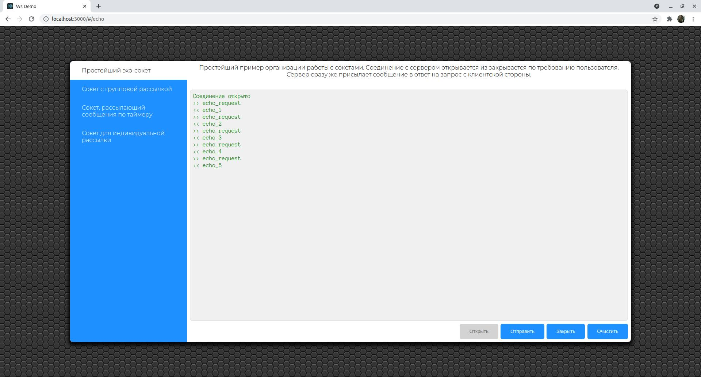
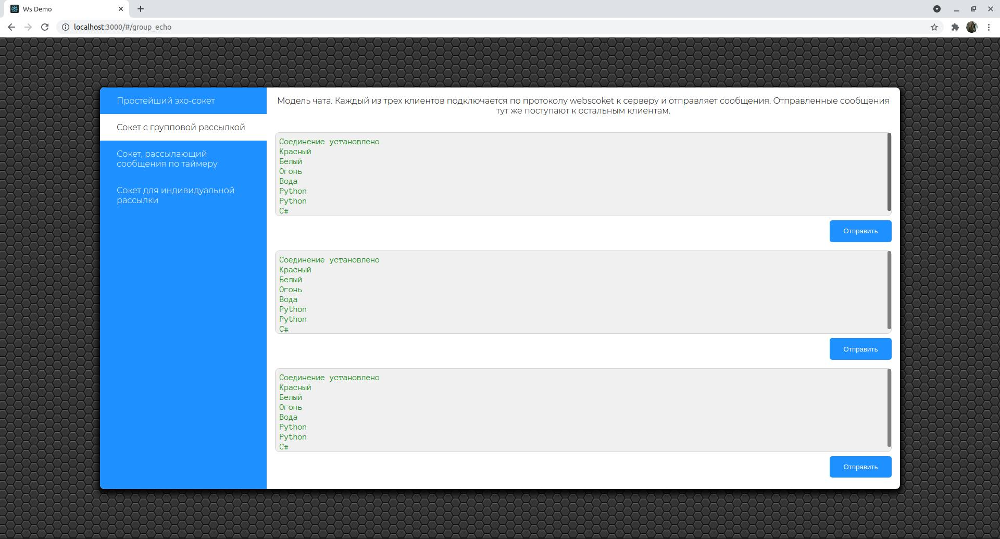
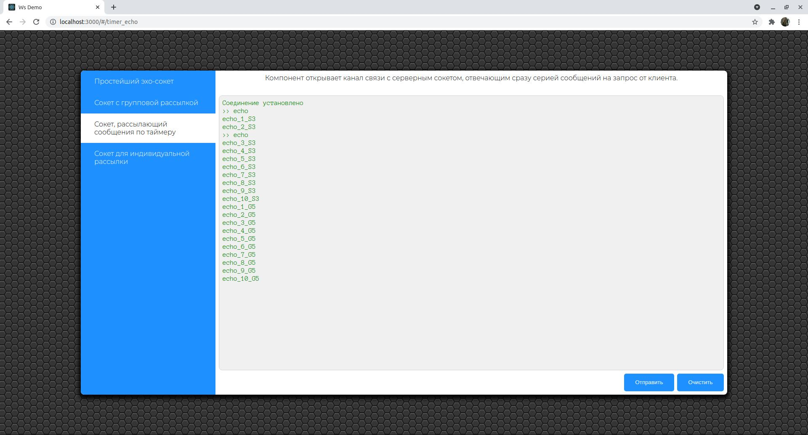
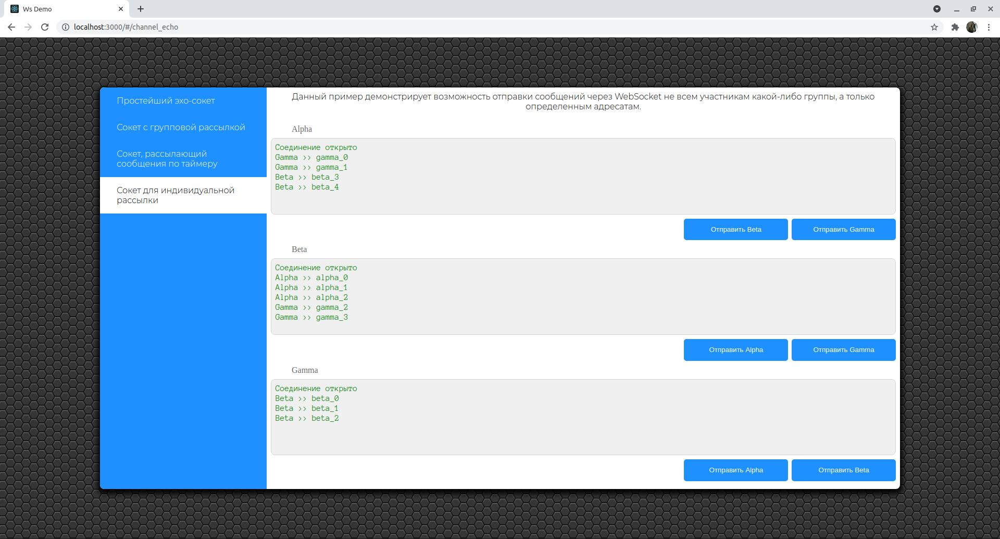

# ws_demo_client

Клиентская часть [небольшого учебного проекта](https://github.com/SergeyLebidko/ws_demo_server) для отработки приемов работы с Websocket'ами. 
Приложение простое и разбито на 4 раздела, иллюстрирующих разные приемы работы вебсокетов.

Для каждого раздела на сервере создан соответствующий обработчик, реализующий логику получения сообщений и отправки ответов. Все сообщения текстовые.

Первый раздел - простейший эхо-сокет. Он получает сообщение от клиента и тут же отправляем строку в ответ.

Второй раздел - миниатюрный чат из трех клиентов. При подключении клиента, код на сервере сразу же добавляет его в группу и когда клиент отправляет на сервер сообщение, оно сразу же рассылается всем членам группы.

Третий раздел - сокет, отправляющий сообщения на клиент по таймеру.

Четвертый раздел - сокет, позволяющий организовать отправку сообщений заданному абоненту (клиенту). При подключении к серверу, клиент отправляет ему свое имя (или идентификатор), сервер запоминает его и в дальнейшем, при отправке сообщений клиентами использует это имя для определения адресата данных и доставки сообщения только заданному клиенту (без необходимости массовой групповой рассылки.

